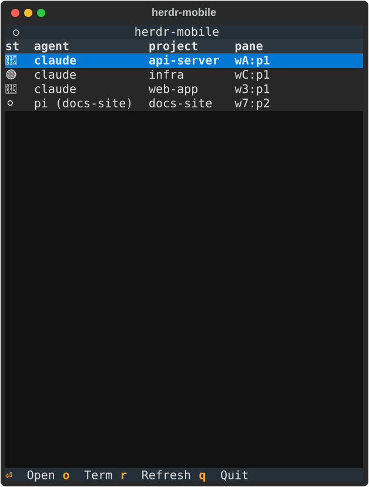
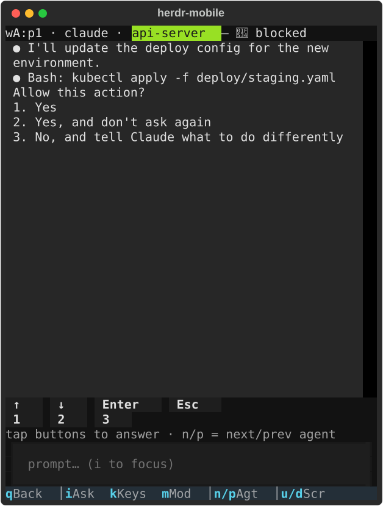

# herdr-mobile

[](LICENSE)

A phone-friendly TUI for triaging and controlling [Herdr](https://herdr.dev)
coding agents from an SSH session. Open [Termius](https://termius.com) (or
any SSH client) on your phone, SSH into the machine running Herdr, run
`herdr-mobile`, and you get a portrait-sized list of every live agent, its
live output, a prompt box, and a tappable key row for answering `blocked`
approval prompts — without opening the full Herdr TUI, and without needing a
physical keyboard.

Why: Herdr's own TUI is built for a wide terminal at a desk. herdr-mobile is
the same control surface reshaped for a narrow touchscreen — everything is
tappable, and the layout, scrolling, and output trimming all assume you're
looking at a phone.

Single-file Python + [Textual](https://textual.textualize.io/) app
(`herdr_mobile.py`) that wraps the `herdr` CLI (JSON in, JSON out). No direct
socket protocol use.




## Requirements

- A running [Herdr](https://herdr.dev) instance, with the `herdr` CLI on
  `PATH` — version `>=0.7.3` (earlier versions weren't verified against this
  client)
- [`uv`](https://docs.astral.sh/uv/) (`brew install uv`, or see the uv docs
  for other platforms)
- Python `>=3.12` (uv will fetch this for you if it's not already installed)

**Platforms:** tested on macOS; Linux should work identically (nothing
platform-specific — plain Python/Textual over the `herdr` CLI), reports
welcome. Windows is untested and undeclared.

## Install

### Quick install

```bash
curl -fsSL https://raw.githubusercontent.com/bsorescu/herdr-mobile/main/install.sh | sh
```

Installs [`uv`](https://docs.astral.sh/uv/) first if it's missing, then runs
`uv tool install --force` to install (or upgrade) the `herdr-mobile`
command onto your `PATH`. Safe to re-run any time to upgrade. See
`install.sh` in the repo root for exactly what it does before piping it to
`sh`, as always with any curl-pipe-to-shell install.

### Option 1: clone + run

```bash
git clone https://github.com/bsorescu/herdr-mobile.git
cd herdr-mobile
uv run herdr_mobile.py
```

`herdr_mobile.py` declares its own dependencies via PEP 723 inline script
metadata (just `textual`), so `uv run` handles the virtualenv for you — no
separate install step needed.

To put a `herdr-mobile` command on your `PATH`:

```bash
mkdir -p ~/.local/bin
cp bin/herdr-mobile ~/.local/bin/herdr-mobile
```

The wrapper resolves the repo directory from its own location, so it keeps
working if you move the clone or symlink the wrapper elsewhere. Make sure
`~/.local/bin` is on `PATH` in your interactive shell
(`zsh -ic 'command -v herdr-mobile'` should print the path).

### Option 2: `uv tool install`

```bash
uv tool install git+https://github.com/bsorescu/herdr-mobile
```

This installs the packaged `herdr-mobile` entry point (from `pyproject.toml`)
straight onto your `PATH` via `uv`'s tool shims — no clone or manual `PATH`
setup needed.

## Usage

```bash
herdr-mobile
```

## Key map

### Agent list screen

| Key | Action |
|---|---|
| `j` / `k` | Move selection down / up |
| `enter` | Open selected agent |
| `o` | Open a new terminal space (see below) |
| `r` | Refresh list |
| `q` | Quit app |

Agents are sorted by pure recency of when you last opened them from THIS
phone — most-recently-opened first, persisted to
`~/.local/state/herdr-mobile/access_history.json`. This is deliberate: it's
easy to send a prompt to the wrong agent when you expected the one you just
looked at to still be on top. Status doesn't drive the ordering (it's still
visible via the icon) — an agent you opened five minutes ago stays above a
`blocked` one you've never opened. Agents you haven't opened from this
phone yet fall to the bottom, in triage order (`blocked` → `done` →
`working` → `idle` → `unknown`) among themselves. If `herdr` can't be
reached, an error banner replaces the table; `r` retries.

### Agent detail screen

| Key | Action |
|---|---|
| `i` | Focus the prompt box (type, then `enter` to send) |
| `→` (in the prompt box) | Accept the ghost-text prompt-history suggestion, if one is showing |
| `k` | Toggle the remote-control key bar |
| `n` / `p` | Cycle to next / previous agent (list order) |
| `u` / `d` | Scroll output up / down half a page |
| `m` | Cycle the agent's permission mode (sends `ctrl+p`, same as Claude Code's own binding) |
| `q` / `esc` | Back to list — but while the remote-control bar is open, neither goes back: `q` closes the bar instead, and `esc` is forwarded to the agent instead (see below) |

The footer at the bottom groups its entries — `q Back` │ `i Ask` `k Keys`
`m Mod` │ `n/p Agt` │ `u/d Scr` — visually separating the exit key, actions
on the current agent, cycling to another agent, and scrolling the output.
Every entry is tappable (not just readable), and does the same thing as its
physical key regardless of what else has focus. A few labels are
abbreviated (`Ask` for the prompt box, `Mod`/`Agt`/`Scr` for mode-cycling/
agent-cycling/scroll) to fit all six entries and all three separators on a
44-column phone screen.

The output pane follows the agent's live output automatically; scrolling up
pauses following (so you can read history without it jumping), scrolling
back to the bottom resumes it. `u`/`d` scroll it half a page at a time and
work regardless of which widget has focus (touch clients like Termius can't
send mouse-wheel events, and physical arrow keys only scroll the output
while it's focused) — except while the prompt box is focused, where typing
`u`/`d` inserts the characters instead, same as any other letter.

The prompt box offers fish/Claude-Code-style ghost-text completion from
your prompt history as you type: it suggests the most recent previously
sent prompt that starts with what you've typed so far, dimmed in after the
cursor — press `→` at the end of the line to accept it, or keep typing to
ignore it. History is shared across all agents (prompts like "continue" or
"run the tests" are often reused) and persisted to
`~/.local/state/herdr-mobile/prompt_history.json`, capped at the 200 most
recent, deduped against immediate repeats.

The remote-control bar (`k`) shows only the buttons relevant to what the
agent is actually asking. `↑ ↓ Enter Esc` are always there while the bar is
open — useful for any agent menu. `y`/`n` and the numbered-option row only
appear when the agent's own output actually looks like that kind of
prompt: `y`/`n` show up for a y/n-style confirmation (`(y/n)`, `[Y/n]`, "y
or n", …), and digit buttons `1` through however many options were
detected (up to `9`) show up for a numbered dialog (e.g. a 6-option
permission menu shows `1`-`6`) — no options detected means no digit
buttons at all, and no y/n marker means no `y`/`n` buttons. This is
recomputed on every refresh, so the bar adapts as the agent's output
changes. It also auto-opens the first time an agent goes `blocked`, and
auto-closes again once the agent leaves `blocked` — unless you opened it
yourself with `k`, in which case it stays open. While it's open, physical
keyboard keys are still forwarded for arrows/Enter/Tab/Esc/y/1-9 regardless
of which buttons are currently shown (forwarding a key with no matching
button is harmless) — **but not `n` or `p`**: those always cycle to the
next/previous agent, bar open or closed, so to answer *No* you have to tap
the on-screen `[n]` button when it's showing (the bar's own hint line says
`n/p = next/prev agent`, plus `tap buttons to answer` whenever there's
something to tap).

For Claude Code agents, the detected permission mode (`auto`, `plan`, or
`bypass`) is shown inline on the session border row at the bottom of the
output — e.g. `── auto ──────────── my-session ──` — colored to match
Claude Code's own status line (auto = yellow, plan = cyan, bypass = red).
Nothing is shown for other agents (e.g. pi) or when no mode marker is
visible. Press `m` to cycle it — that sends `ctrl+p` to the agent's pane,
Claude Code's own mode-cycle binding; the display catches up on the next
poll.

### Terminal space

Sometimes you don't want an agent — you want a real shell, phone-shaped, to
navigate around and start one yourself, exactly like you would sitting at
the Mac. Press `o` on the agent list to open one: herdr-mobile creates a
brand-new herdr workspace (`herdr workspace create --no-focus` — it never
touches any existing pane, and never steals focus from whatever your Mac
session is doing) and opens a terminal screen for it.

| Key | Action |
|---|---|
| `i` | Focus the command box (type a command, then `enter` to run it — exactly what typing at a shell prompt does) |
| `k` | Toggle the remote-control key bar (`↑ ↓ Enter Esc` — for `less`, `vim`, interactive menus, tab-completion, etc.) |
| `u` / `d` | Scroll output up / down half a page |
| `q` | Back to the agent list — closes the bar first if it's open, same as the agent detail screen |

The terminal screen reuses the exact same output pipeline as an agent's
detail screen (glued-bullet spacing, wide-rule/wide-gap collapsing, ANSI
handling), the same prompt box with shared prompt-history autosuggestions,
and the same scroll-follow/pause behavior — it's just not tied to an
agent's status, so there's no permission-mode display, no dialog-answer
buttons, no stall warning, and no `n`/`p` agent-cycling (`q` only).

If you launch `claude` or `pi` inside the terminal, herdr detects it as a
real agent on its own — no action needed here. It'll show up in your agent
list on the next refresh; herdr-mobile also shows a one-time "Agent
detected — it's in your list now" toast right on the terminal screen, but
doesn't navigate you away from what you're looking at. The workspace you
created stays around after you back out — herdr-mobile never auto-closes
it, so it's yours to keep, reopen (from the agent list, once something's
running in it) or close from the Mac like any other workspace.

## Termius tips

Everything in the UI is tappable (row selection, buttons, prompt input), so
a bare Termius session works with no extra setup — no `Esc` key needed, no
extra-keys row required. An extra-keys row (for `Esc`, `Tab`, arrows) is
optional convenience, not required — the remote-control bar exists
specifically so you don't need one to answer a `blocked` agent's prompt.
The footer entries themselves are tappable too — tapping `Keys` toggles the
remote-control bar, so `k` is never required on touch.

## Troubleshooting

**"herdr CLI not found on PATH"** — herdr-mobile execs `herdr` as a
subprocess; it needs to be resolvable from the same `PATH` the app runs
under. If you installed herdr into a shell-specific location (e.g. via nvm,
pipx, or a login-shell-only PATH addition), check that a non-interactive
shell can still find it, or set `PATH` explicitly before launching
herdr-mobile.

**"Cannot reach herdr"** banner on the agent list — the `herdr` server
itself isn't running, or the `agent list` call errored. Press `r` to retry
once it's back up.

**An agent disappears from the detail screen** — if the pane herdr-mobile
has open closes or gets removed from Herdr's own agent list, herdr-mobile
detects this on its next poll, pops back to the list, and shows a warning
toast (`Agent <pane_id> is gone`).

## Development

Run the test suite:

```bash
./scripts/test.sh
```

This installs its own pinned pytest/pytest-asyncio/textual versions via
`uv run --with ...`, independent of `pyproject.toml`, so it always tests
against the same dependency versions regardless of your local environment.

Regenerate the demo screenshots (`docs/demo-*.svg`) after a UI change:

```bash
uv run scripts/make_demo.py
```

This drives the app headlessly against a fake `HerdrClient` with synthetic
agents — no real Herdr instance required.

## License

MIT — see [LICENSE](LICENSE).
